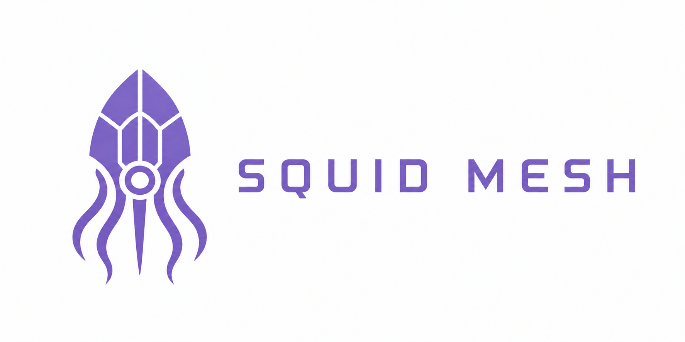

  

Embeddable durable workflow runtime for Elixir applications.

Squid Mesh lets application teams define workflows declaratively in Elixir and execute them through a stable application-facing API. It is designed to plug into existing Phoenix and OTP applications so engineers can expose workflow capabilities through their own endpoints, services, and domain boundaries.

## What It Provides

- Declarative workflow definitions in Elixir modules
- Durable workflow runs and step state
- Retry, resume, cancel, and replay semantics
- Public API for starting, inspecting, listing, cancelling, and replaying runs
- Integration with an existing `Repo` and background job setup

## Product Shape

- Embeddable library, not a hosted product
- API-first runtime for Elixir applications
- Declarative developer experience that hides execution internals
- Built for operational visibility from day one
